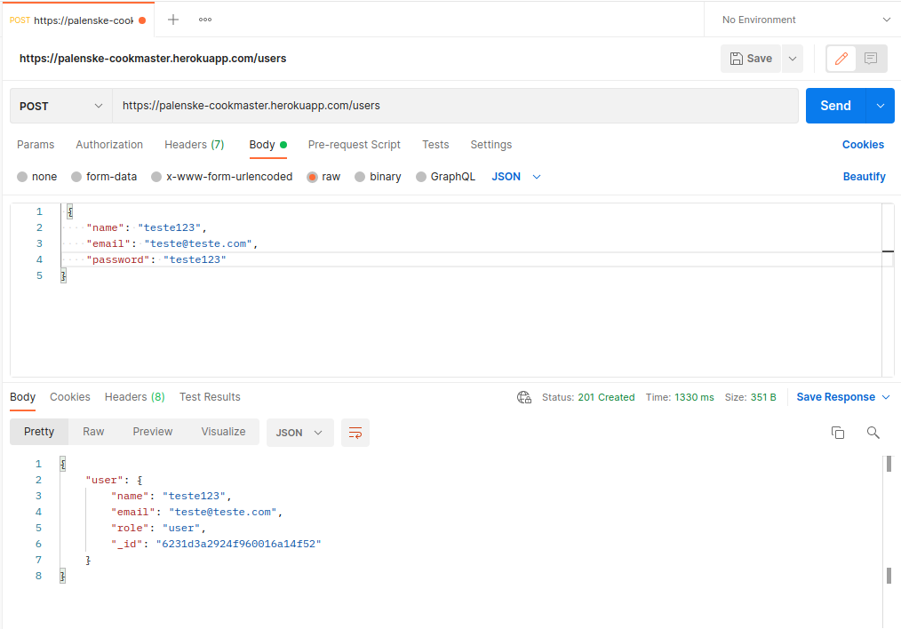
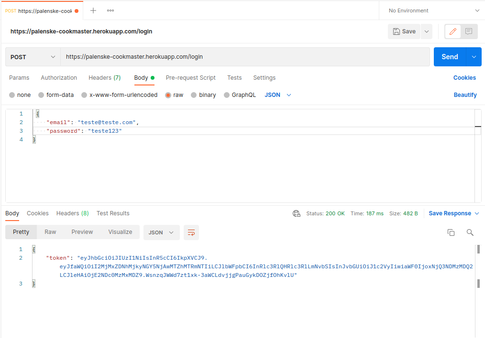
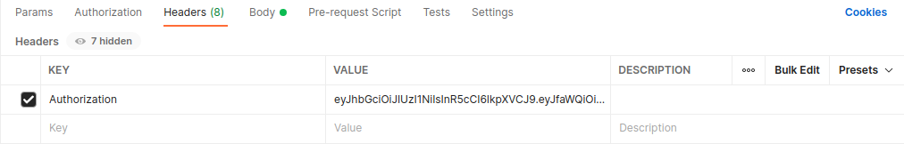
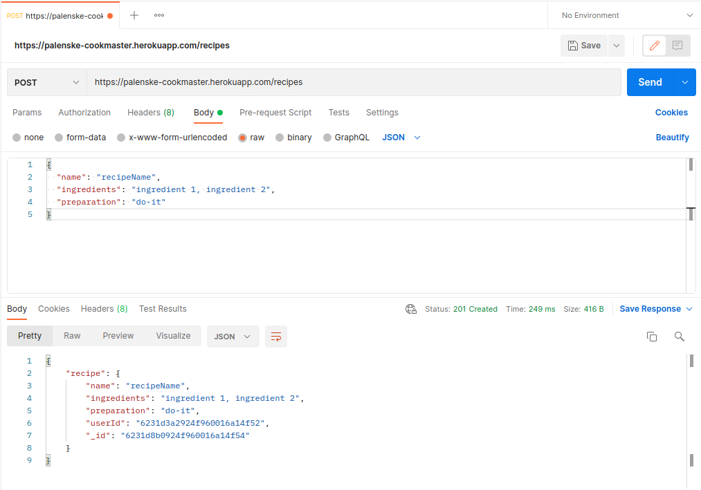
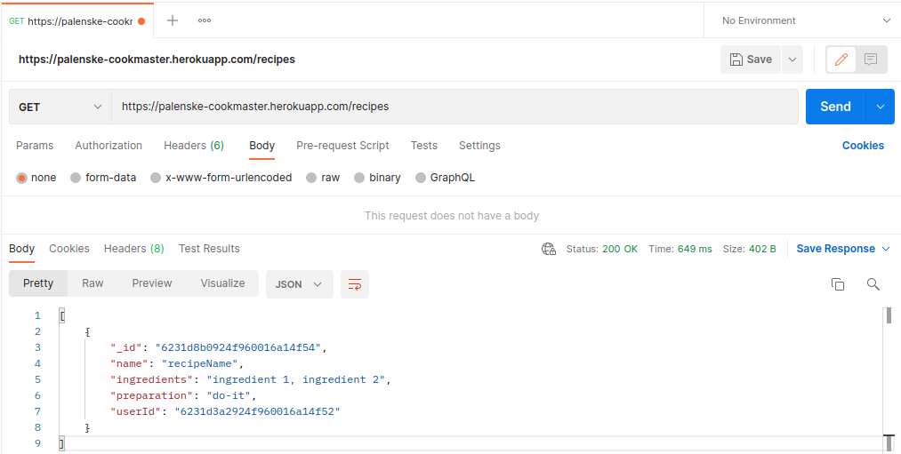
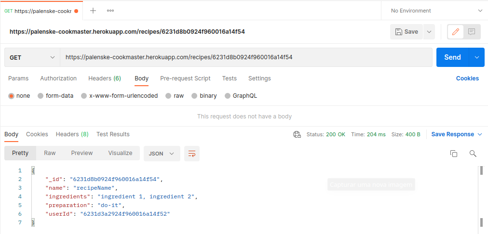
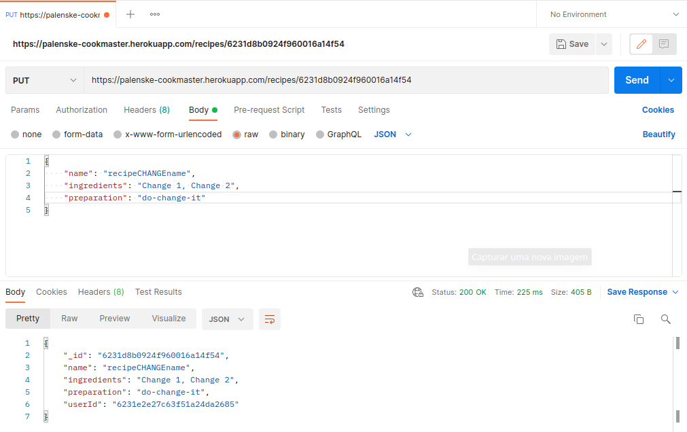
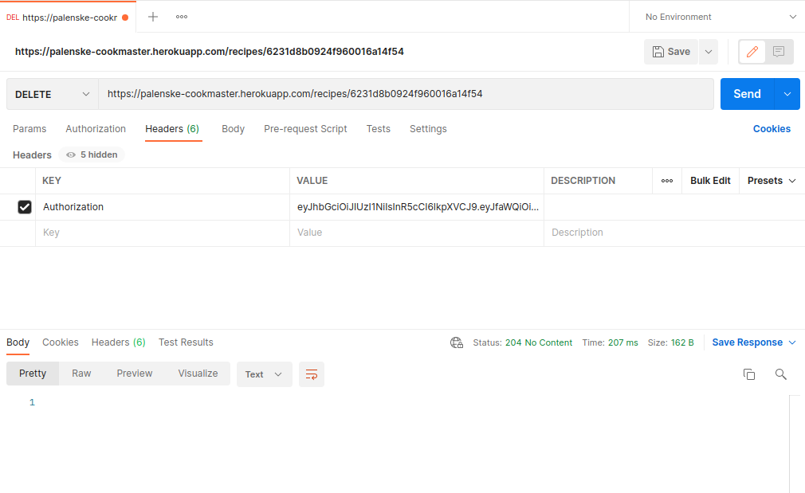

<h1 align="center">
  Cookmaster Project :cook:
</h1>
<h4 align="center"> 
  :notebook_with_decorative_cover: Armazene e consulte suas melhores receitas! :fried_egg:
</h4>

## Sobre o projeto

Consiste numa [API](https://palenske-cookmaster.herokuapp.com/) que armazena e fornece receitas :yum:
Nela é possível fazer o cadastro e login de pessoas usuárias, sendo apenas essas pessoas que poderão acessar, modificar e deletar as receitas que cadastrou.
As funcionalidades desse projeto são:
  - [Cadastro de usuário](#1---cadastrar-usuário)
  - [Login](#2---login-de-usuários)
  - [Cadastro de receitas](#3---cadastrar-receita)
  - [Listar receitas](#4---listar-receitas)
  - [Listar receita por ID](#5---visualizar-uma-receita-específica)
  - [Login como administrador](#6---conta-de-administrador)
  - [Editar receita](#7---editar-uma-receita)
  - [Excluir receita](#8---excluir-uma-receita)
  - [Adicionar imagem a uma receita](#9---adicionar-uma-imagem-a-uma-receita)
  - [Acessar imagem de uma receita](#10---acessar-a-imagem-de-uma-receita)

## Tecnologias usadas
- Node.js
- Express.js
- Validações com [JOI](https://www.npmjs.com/package/joi)
- upload de arquivos com o [multer](https://www.npmjs.com/package/multer)
- JWT
- Arquitetura REST e MSC
- Mocha/Chai
- Sinon
- MongoDB (cloud)
- Heroku

## Habilidades desenvolvidas

- Gerar tokens a partir de informações como login e senha;
- Autenticar rotas do Express, usando o token JWT;
- Fazer upload de arquivos em APIs REST;
- Salvar arquivos no servidor através de uma API REST;
- Consultar arquivos do servidor através de uma api REST.
- Realizar testes de integração


## Como rodar a aplicação localmente e executar testes de integração
> Certifique-se de que tenha o Git e o NPM instalados em sua máquina. Caso não os tenha rode os seguintes comandos:
> `sudo apt install git-all` && `sudo apt install npm`
- Faça um clone do repositório em sua máquina:
  `git clone https://github.com/palenske/cookmaster.git`
- Entre no diretório do projeto:
  `cd cookmaster`
- Instale as dependências:
  `npm install`
- Inicie a aplicação:
  `npm start`
- Para rodar os testes, com a aplicação rodando, rode o seguinte comando:
 `npm run dev:test`

## Como utilizar os end-points da API:
* A aplicação está rodando num servidor **[heroku](https://palenske-cookmaster.herokuapp.com/)**, configurada para salvar os dados num cluster MongoDB em nuvem.
> O heroku mantém as aplicações free em estado de dormencia, acesse o [link](https://palenske-cookmaster.herokuapp.com/) para ligar.

* Para consumir a API, exemplificarei com o **[postman](https://web.postman.co/home)**
> Caso tenha alguma dúvida de como configurar as requisições do postman, observe atentamente as imagens no final de cada função deste readme.

### 1 - Cadastrar usuário

- Utilize a seguinte rota: `https://palenske-cookmaster.herokuapp.com/users`

- O verbo HTTP deverá ser `POST`

- No banco, um usuário terá os campos Email, Senha, Nome e Role.

- Para criar um usuário através da API, todos os campos são obrigatórios, com exceção do Role.

- O campo Email deve ser único.

- Usuários criados através desse endpoint terão o campo Role com o atributo _user_, ou seja, usuários comuns, e não admins.

- O body da requisição deve conter o seguinte formato:

  ```json
  {
    "name": "string",
    "email": "string",
    "password": "string"
  }
  ```

**Validações:**

- **[Será validado que o campo "name" é obrigatório]**

- **[Será validado que o campo "email" é obrigatório]**

- **[Será validado que não é possível cadastrar usuário com o campo email inválido]**

- **[Será validado que o campo "senha" é obrigatório]**

- **[Será validado que o campo "email" é único]**

- **[Será validado que o usuário foi cadastrado com sucesso]**

- **[Será validado que, ao cadastrar usuário, o valor do campo "role" tenha o valor "user"]**
Se o usuário for cadastrado com sucesso o resultado retornado deverá ser conforme exibido abaixo, com um status http `201`:



### 2 - Login de usuários

- Utilize a seguinte rota: `https://palenske-cookmaster.herokuapp.com/login`

- O verbo HTTP deverá ser `POST`

- A rota deve receber os campos Email e Senha e esses campos devem ser validados no banco de dados.

- Na configuração do `JWT` **não está sendo utilizado variáveis de ambientes**.

- Um token `JWT` será gerado e retornado caso haja sucesso no login. 

- O body da requisição deve conter o seguinte formato:

  ```json
  {
    "email": "string",
    "password": "string"
  }
  ```

**Validações:**

- **[Será validado que o campo "email" é obrigatório]**

- **[Será validado que o campo "password" é obrigatório]**

- **[Será validado que não é possível fazer login com um email inválido]**

- **[Será validado que não é possível fazer login com uma senha inválida]**

- **[Será validado que é possível fazer login com sucesso]**
Se foi feito login com sucesso o resultado retornado deverá ser conforme exibido abaixo, com um status http `200`:
> copie o `token` para realizar os próximo passos.


### 3 - Cadastrar receita

- Utilize a seguinte rota: `https://palenske-cookmaster.herokuapp.com/recipes`

- A receita só pode ser criada caso o usuário esteja logado e o token `JWT` validado.


- O verbo HTTP deverá ser `POST`

- No banco, a receita terá os campos Nome, Ingredientes, Modo de preparo, URL da imagem e Id do Autor.

- Nome, ingredientes e modo de preparo devem ser recebidos no corpo da requisição, com o seguinte formato:

  ```json
  {
    "name": "string",
    "ingredients": "string",
    "preparation": "string"
  }
  ```

- O campo dos ingredientes pode ser um campo de texto aberto.

- O campo ID do autor, será extraído do token JWT.

- A URL da imagem será preenchida através de outro endpoint

**Validações:**

- **[Será validado que não é possível cadastrar receita sem o campo "name"]**

- **[Será validado que não é possível cadastrar receita sem o campo "ingredients"]**

- **[Será validado que não é possível cadastrar receita sem o campo "preparation"]**

- **[Será validado que não é possível cadastrar uma receita com token invalido]**

- **[Será validado que é possível cadastrar uma receita com sucesso]**
O resultado retornado para cadastrar a receita com sucesso deverá ser conforme exibido abaixo, com um status http `201`:



### 4 - Listar receitas

- Utilize a seguinte rota: `https://palenske-cookmaster.herokuapp.com/recipes`.

- O verbo HTTP deverá ser `GET`

- A rota pode ser acessada por usuários logados ou não

**Validações:**

- **[Será validado que é possível listar todas as receitas sem estar autenticado]**

- **[Será validado que é possível listar todas as receitas estando autenticado]**



### 5 - Visualizar uma receita específica

- Utilize a seguinte rota: `https://palenske-cookmaster.herokuapp.com/recipes/:id`.

- A rota pode ser acessada por usuários logados ou não

**Validações:**

- **[Será validado que não é possível listar uma receita que não existe]**

- **[Será validado que é possível listar uma receita específica sem estar autenticado]**

- **[Será validado que é possível listar uma receita específica estando autenticado]**

O resultado retornado para listar uma receita com sucesso deverá ser conforme exibido abaixo, com um status http `200`:




### 6 - Conta de administrador

- No banco há uma conta com o role `admin`
> email: root@email.com / password: admin

- Com ela é possível executar os passos a seguir com privilégios de administrador


### 7 - Editar uma receita

- Utilize a seguinte rota: `https://palenske-cookmaster.herokuapp.com/recipes/:id`

- O verbo HTTP deverá ser `PUT`

- A receita só pode ser atualizada caso o usuário esteja logado e o token `JWT` validado.

- A receita só pode ser atualizada caso pertença ao usuário logado, ou caso esse usuário seja um admin.

- O corpo da requisição deve receber o seguinte formato:

  ```json
  {
    "name": "string",
    "ingredients": "string",
    "preparation": "string"
  }
  ```

**Validações:**

- **[Será validado que não é possível editar receita sem estar autenticado]**

- **[Será validado que não é possível editar receita com token inválido]**

- **[Será validado que é possível editar receita estando autenticado]**

- **[Será validado que é possível editar receita com usuário admin]**
O resultado retornado para editar uma receita com sucesso deverá ser conforme exibido abaixo, com um status http `200`:



### 8 - Excluir uma receita

- Utilize a seguinte rota: `https://palenske-cookmaster.herokuapp.com/recipes/:id`

- O verbo HTTP deverá ser `DELETE`

- A receita só pode ser excluída caso o usuário esteja logado e o token `JWT` validado.

- A receita só pode ser excluída caso pertença ao usuário logado, ou caso o usuário logado seja um admin.

**Validações:**

- **[Será validado que não é possível excluir receita sem estar autenticado]**

- **[Será validado que é possível excluir receita estando autenticado]**

- **[Será validado que é possível excluir receita com usuário admin]**

O resultado retornado para excluir uma receita com sucesso deverá ser conforme exibido abaixo, com um status http `204`:



### 9 - Adicionar uma imagem a uma receita

- Utilize a seguinte rota: `https://palenske-cookmaster.herokuapp.com/recipes/:id/image/`.

- O verbo HTTP deverá ser `PUT`

- A imagem será lida do campo `image`.

- O endpoint aceitará requisições no formato `multipart/form-data`.

- A receita só pode ser atualizada caso o usuário esteja logado e o token `JWT` validado.

- A receita só pode ser atualizada caso pertença ao usuário logado ou caso o usuário logado seja admin.

- O upload da imagem será feito utilizando o `Multer`.

- O nome do arquivo será o ID da receita, e sua extensão `.jpeg`.

- A URL completa para acessar a imagem através da API será gravada no banco de dados, junto com os dados da receita.

**Validações:**

- **[Será validado que é possível enviar foto com usuário autenticado]**

- **[Será validado que ao enviar foto, o nome da imagem é alterada para o id da receita]**

- **[Será validado que não é possível enviar foto sem estar autenticado]**

- **[Será validado que é possível enviar foto com usuário admin]**
O resultado retornado para adicionar uma foto na receita com sucesso deverá ser conforme exibido abaixo, com um status http `200`:


### 10 - Acessar a imagem de uma receita

- As imagens estarão disponíveis através da rota `/images/<id-da-receita>.jpeg` na API.

**Validações:**

- **[Será validado que é retornada uma imagem como resposta]**
O resultado retornado deverá ser do tipo imagem, com um status http `200`:
> Você pode ver a imagem acessando o link gerado na função anterior, direto do navegador
> exemplo: https://palenske-cookmaster.herokuapp.com/images/6231ef3d3b39b70016237c77.jpeg


